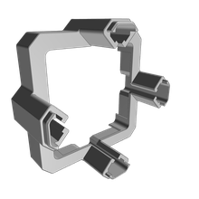
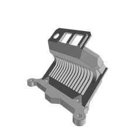
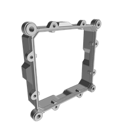
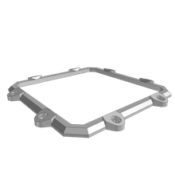

# ApolloHardware
This is the full set of source files and tools necessary to build and operate DS Apollo 1 Lamps

## Sub Assemblies
Full Assembly of a set with a delivery within 2h of driving for XXX USD?
Total BOM cost: 489 / 851.41

### Bag
Will use DS Voyager 2ft Bag (link to webstore?)
* Price: 36.02683

### Apollo 1 Lamp Head
The light module itself

#### BOM
1. Custom
    * Price total: 650.48
    * Assembly time total: 
    * Assembly cost: 
    1. Electronics
        * Price total: 112.601
        1. Apollo 1 Module Controller Board (P2)
            * qty: 1
            * Price: 28.151
            * Manufacturer: PCB Way
        1. Apollo 1 controller board SMD (P2)
            * qty: 1
            * Price: 50.35
            * Manufacturer: PCB Way
        1. BUC Converter
            * qty: 11
            * price: 3.1
            * Vendor: [Ali...]      
    1. Metal
        * Price total: 261.27
        1. LED Cooler [(M)SPPS000000002.1]
            * qty: 1
            * price: 167.77
            * Manufacturer: Hubs [CNC]
        1. Controller Cooler (P2) [(M)SPPS000000003.1]
            * qty: 1
            * price: 42.39.90
            * Manufacturer: Hubs [CNC]
        1. 16mm Al Pipe 16x (Wall=1.5)
            * qty: 0.8m
            * price: 1.842/m
            * Vendor: [... online? ...]
    1. Plastic
    * Price total: 69.97
        1. Apollo Enclosure Cooler Cover [(P)MPLA000000084.2]
        
            * qty: 1
            * price: 17.16/(7.47)
            * print [4h35m / 3.42 / 4.05] 
            * Vendor: Hubs [FDM]
        1. Apollo Enclosure Antenna Holder [(P)MPLA000000097.2]
        
            * qty: 1
            * price: 9.72/(3.16)
            * print [2h6m / 1.36 / 1.8] 
            * Vendor: Hubs [FDM]
        1. Apollo Enclosure Cooler Grill P2 [(P)MPLA000000095.2]
        
            * qty: 1
            * price: 10.04/(4.41)
            * print [2h57m / 1.71 / 2.7] 
            * Vendor: Hubs [FDM]
        1. Apollo Enclosure Lens Cover P2 [(P)MPLA000000093.2]
        
            * qty: 1
            * price: 12.96/(5.21)
            * print [3h14m / 2.11 / 3.1] 
            * Vendor: Hubs [FDM]
        1. Apollo Enclosure Lens Cover Lens Frame
        
            * qty: 1
            * price: 2.75/(1.47)
            * print [55m / 0.57 / 0.9] 
            * Vendor: Hubs [FDM]
        1. 16mm Internal Thread Locking End-Cap P2 [(P)MPLA000000138]
        
            * qty: 8
            * price: 0.67/(0.3475)
            * print [2h4m / 0.98 / 1.8] 
            * Vendor: Hubs [FDM]
        1. Buttons part
            * qty: 1
            * price: 0.99/(0.52)
            * print [0h24m / 0.07 / 0.45]
            * Vendor: Hubs [FDM tPU]
        1. BUC module support
            * qty: 1
            * price: 0.99/(0.5)
            * print []
            * Vendor: Hubs [FDM tPU]
        1. Apollo Encolusre Lens Protection Glass [(P)MPLA000000081]
            * qty: 1
            * price: 2.90
            * print
            * Vendor: tba
        1. Lens Mount System
            * qty: 1
            * price: 10.00 (Currently little under 50)
1. Purchase
   * Total: 43.74
    1. Part
    * Price total: 37.94
        1. be quiet! Pure Wings 2 92mm, BL045, Cooling Fan
            * qty: 1
            * Price: 14.85
            * Link: [amazon](https://www.amazon.com/quiet-Case-Fan-Cooling-BL045/dp/B00IOIKG68)
        1. Lens XM-L 15 degrees [5900000141]
            * qty: 16
            * Price: 0.56
        1. Switchcraft DC jack 2.5mm center pin
            * qty: 1
            * Price: 2.97
            * Link: [amazon](https://www.amazon.com/)
        1. Coaxial Cable Assembly, SMA Bulkhead Jack, U.FL Plug, 90°, 100 mm
            * qty: 1
            * Price: 6.19
        1. WiFi Antenna
            * qty: 1
            * Price: 4.97
    1. Fastener
       * Total: 5.80
        1. M6
           * Total: 3.00
            1. Nut M6 DIN934
                * qty: 8
                * Price: .1
            1. Steel M6 127mm
                * qty: 4
                * Price: 0.55
        1. M4
           * Total: 0.40
            1. Bolt M4x40 ISO14580
                * qty: 4
                * Price: .1
        1. M3
           * Total: 2.4
            1. Bolt M3x16 ISO14581
                * qty: 4
                * Price: .1
            1. Bolt M3x6 ISO14580
                * qty: 16
                * Price: .1
            1. Space M3x8
                * qty: 4
                * Price: .1

### Apollo 1 Screen Module
ESP32 Based 320x240 RGB screen used as UI for the light
#### BOM
1. Custom
    * Price total: 124.89
    * Assembly time total: 
    * Assembly cost: 
    1. Electronics
        * Price total: 
        1. WT32 SC01
            * qty: 1
            * Price: 44.90
            * Manufacturer: Seedstudio
        1. M5 Encoder
            * qty: 1
            * Price: 8.90
        1. Apollo Screen Module Controller
            * qty: 1
            * Price: 52.09
        1. TiMo Module
            * qty: 1
            * Price: 19.00
    1. Plastics

### Apollo 1 Modular Yoke
90.00

### Apollo 1 Battery Plate
90.00

### Apollo 1 AC/DC
21.00

### Firmware
Stripped down version of the current hardware keeping only renderer and i2c interface
The calibratiuon will be uploaded via USB

### Software

### Calibration Toolset
